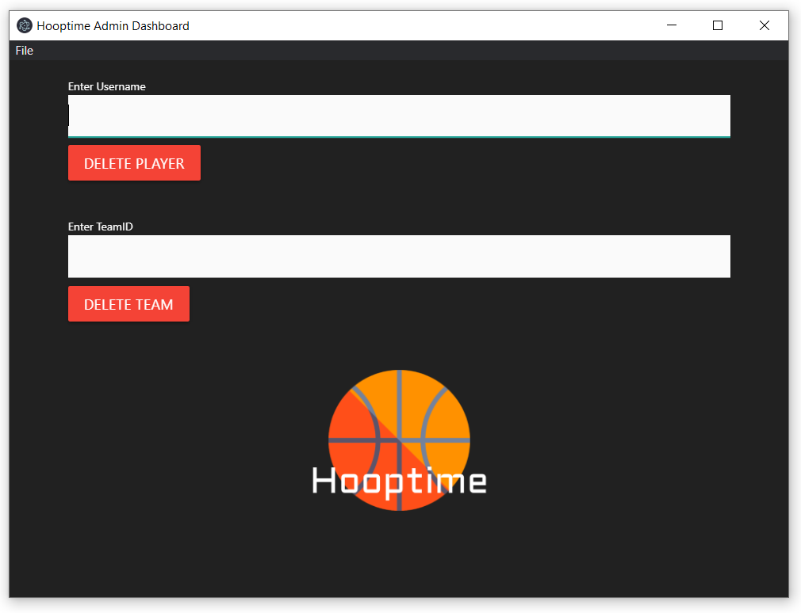

# Hooptime-admin-dashboard
## About
The Hooptime admin dashboard is an application that allows Hooptime admin's to delete players or teams which are deemed inappropriate. By entering a username or team name, all data that is correlated with that player or team will be removed from the database. If a player is removed from a team where he/she is the team captain, a new team captain will be assigned.

